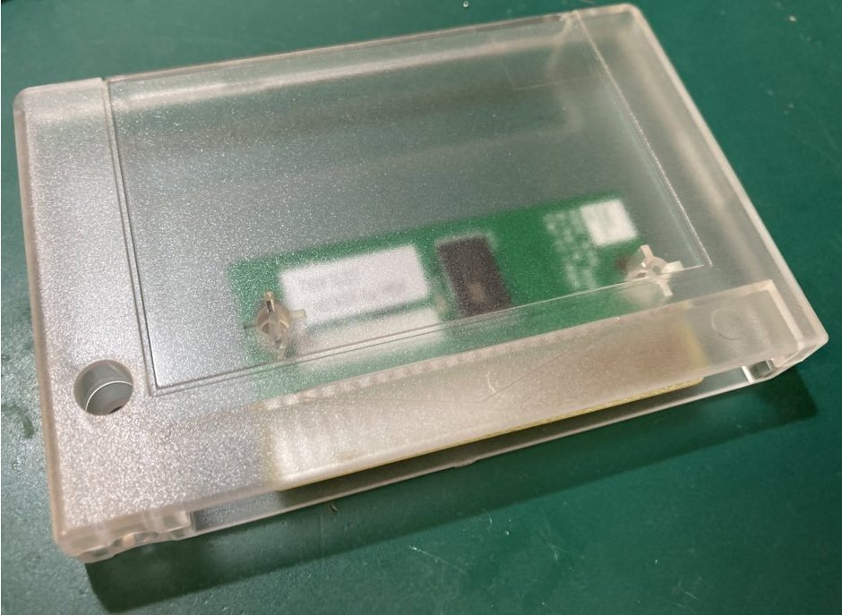
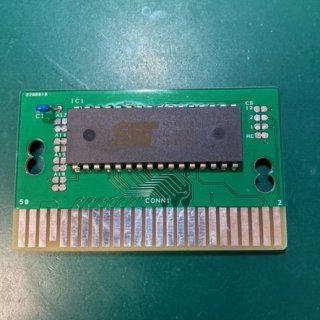
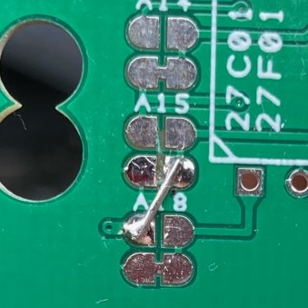
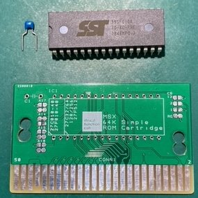
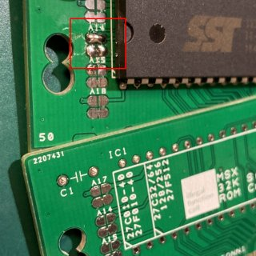
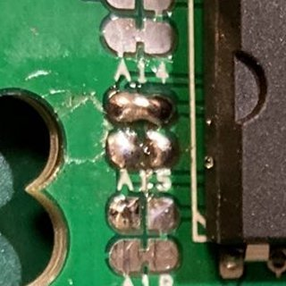
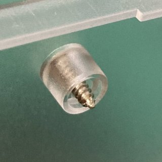

# MSX用カートリッジ<BR>32/64K Simple ROM Cartridge
ひねりも何も無いFlash ROMを32/64KByteをマッピングしたカートリッジです。  
現在入手可能な部品を使い、最小現のパーツで構成されています。  


  
SST社の39SF010/020/040との組み合わせで動作確認を行っていますが、  
基板自体はある程度汎用で利用できる様に設計されており、設定変更で他型番のEPROMの利用が可能です。  


なお、本基板および各パーツは、Boothにて頒布しています。  

●基板/パーツ/完成品  
https://ifc.booth.pm/items/3200264
  
●カートリッジケース(RGR製)  
https://ifc.booth.pm/items/3240279

## ■ Flashの制御方法
Flashのコントロールアドレス2AAAhは2AAAh・コントロールアドレス5555hは5555hにマッピングされています。  
  
本製品は、SST系のFlashを使用しています。  
CMD体系は、AMD系とほぼ同じなのですが、CMDアドレスが違います。  
また、BUSYの出方などもAMD系と異なるため注意してください。  

```
CMD例：
1. Flash Byte-Program 1st : 0x5555 = 0xAA
2. Flash Byte-Program 2nd : 0x2AAA = 0x55
3. Flash Byte-Program 3rd : 0x5555 = 0xA0
4. Write Data             : 0x0000～0xffff = data
```

参考：  
https://www.microchip.com/wwwproducts/en/SST39SF010A  


## ■ Flash書き込みプログラム
書き込みプログラムとして、simplefw.comを同梱しています。  
いずれかのスロットに当該カードリッジを挿入し、以下コマンドを実行してください。  
```
>simplefw.com [書き込みをしたいROM File]　(/0,4,8)
```
オプションとして下記が使えます  
/0 : ROMファイルを0x0000からのアドレスに書き込みます。  
/4 : ROMファイルを0x4000からのアドレスに書き込みます。  
/8 : ROMファイルを0x8000からのアドレスに書き込みます。  
  
書き込みのエンドアドレスは0xBFFFにしてあります。  
0xC000以降の書き込みが必要な場合は下記部分を変更して再コンパイルしてください。  
（0xFFFFは拡張スロットで使われるため書き込みできません）  
```
		//Parameter Check
		if (addressWrite >= 0xC000){				// 4000-Bfffh Write finsh?
			printf("\nROM size is FULL.");			// Ummm.ROM is FULL
```

スロット切り替えが面倒でBIOS Callで1Byteづつ処理しているので遅いです。ゆるして・・・  
  
ソースコードは、z88dkでコンパイル可能です。コンパイルオプションは下記になります。 
```
zcc +msx -create-app -subtype=msxdos -lmsxbios  main.c -o simplefw.com  
```

 
## ■ 頒布基板について（～RevCまで)
本製品は安価に頒布するため端子部はハンダメッキになっています。  
通常使用では問題は確認されていませんが、金メッキに比べると中長期的な信頼製や耐久性が劣ります。
あらかじめご了承ください。

頒布基板は組み立てキットの「DIP版」/完成品「SOP版」の2つのVersionがあります。  
 


DIP版は32Kマッピング(64Kにも変更可能）SOP版は64Kマッピングの違いがあります。
  
| MSX Slot Address | Flash ROM Address(DIP版) | Flash ROM Address(SOP版) |
|---|---|---|
| 0000-3FFF | 0000-3FFF | 0000-3FFF |
| 4000-7FFF | 4000-7FFF | 4000-7FFF |
| 8000-BFFF | 0000-3FFF(mirror) | 8000-BFFF |
| C000-FFFF | 4000-7FFF(mirror) | C000-FFFF |

DIP版もA15ジャンパの設定変更でSOP版と同じメモリ配置にすることが可能です。

## ■ 頒布基板について（RevD以降)
金メッキ仕上げ品に変更になっているため上記問題はありません。  
メモリマッピングはSOP版と同じメモリ配置になっています。  
  
ガーバファイルを同梱していますので量産や仕様変更をされたい場合に利用ください。  

## ■ ジャンパ設定について
組み立てキットの「DIP版」にはいくつかのジャンパが用意されています。  
設定を変更することにより、アドレス空間のマッピングや違う種類のEPROMを使う事が可能です。  
※Default値は、RevDの設定値(SST39SF010向け)になります、Revにより異なりますので注意ください。  

|ジャンパ  | A17(30Pin) | A14(29Pin) | A15(3Pin) | A18(1Pin) |
|---|---|---|---|---|
| 上側  | +5V  | A14(Default)  | A15(Default) | +5V |
| 下側  | GND(Default)  | A15  | GND  | GND(Default)  |

|CSジャンパ  | ROM ADDRESS |
|---|---|
| RD  | 0x0000-0xFFFF(Default) |
| CS1  | 0x4000-0x7FFF  |
| CS2  | 0x8000-0xBFFF  |
| CS12  | 0x4000-0x7FFF  |

## ■ EPROM設定例
|ジャンパ  | A17(30Pin) | A14(29Pin) | A15(3Pin) | A18(1Pin) |
|---|---|---|---|---|
| 27C32/64/128/256 | 上(+5V)  | 下(A15)  | 下(GND) or 両方カット＋+5Vへのジャンパ | 下(GND) |
| 27C010/040 | 下(GND)  | 下(GND)  | 下(GND)  | 上(+5V) |
  


### 27C32～256使用時の注意
VPPがGNDでも動作するROMの使用を想定しています。  
VPPに+5Vを要求するタイプの場合、A15に+5Vの選択がないためジャンパが必要です。  
A18上パッド左側が+5Vなので、A15パッドを両方カットし、右側にジャンパしてください。  
  

CSジャンパは、使用したいアドレス領域に合わせてCS1/2/12のいずれかを設定してください。  
27C256を使う場合はアドレスの配置が16KByteで反転するため、A14の設定も必ず変更する様にしてください。


## ■ 基板の組み立て方法
セオリー通り背の低い部品から半田付けしてください。IC1->C1が良いと思います。  
ICソケットを使うとケースに入らなくなるので注意してください。  

## ■ 部品表
| 部品番号 | 部品名 |
|---|---|
| IC1  | Flash ROM SST39SF010/020/040 |
| C1  | コンデンサー0.1uF (104) |
| PCB  | 専用PCB |





### ■ DIP版 RevBについて
A14 ジャンパのDefault設定が間違っています。下側のパターンをカットし、上側をショートさせてください。  
 

## ■ カードリッジシェルについて
推奨はRGRさんのTransparent Cartridge Shell for MSX Konami-styleになります。  
https://retrogamerestore.com/store/msx_cart_shell/  
  
Boothや委託先でも購入が可能です。
輸入と製造都合で若干の小傷がある場合があります。あらかじめご了承ください。  
国内で購入された場合はRGRさんの付属のネジはちょっとネジ穴を壊しやすいので、当方で用意した樹脂製品向けネジが付属します。  
長さが長い方のネジを使用されることを推奨します。

  
  
その他、頒布基板はASCII仕様のいくつかのシェルタイプに対応していますが、  
すべてのタイプには対応していません。ご了承ください。  

